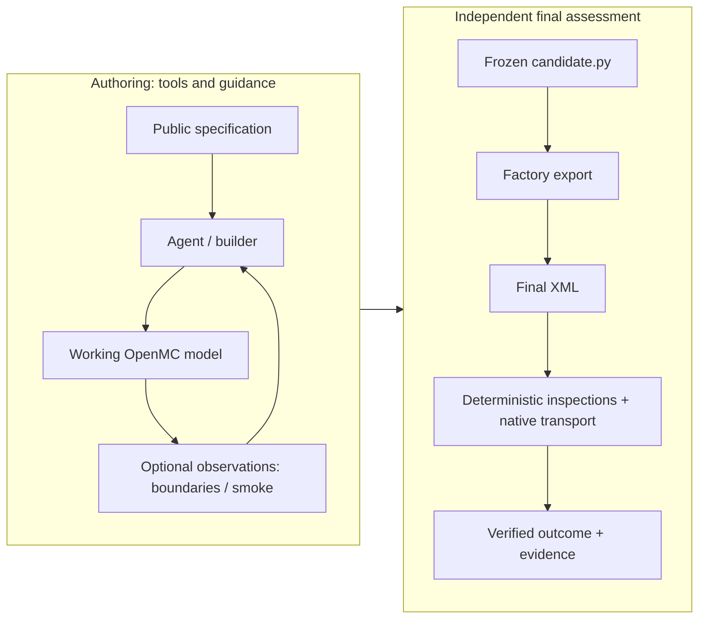

# Neutronics Harness

An evaluation and tool-use framework for studying AI agents that build and
validate OpenMC neutronics models.

## Why this project exists

When do domain-specific scientific tools improve—or fail to improve—an agent's
ability to construct correct models from engineering specifications? This project
studies harness design: the construction environment, feedback, submission
contract and independent assessment, alongside the agent itself.

## What the harness provides

- An isolated OpenMC construction environment with generic programming tools.
- Boundary observations with explicit coverage and indeterminate outcomes.
- Frozen final submissions assessed by independent factory export, programmatic
  scientific checks and separate native transport. **No LLM judge** sets the grade.
- Evidence/provenance binding between inputs, artifacts, execution and outcomes.
- Repeated research comparisons, including an explicit bounded native smoke
  diagnostic during authoring.

**Source versus study:** this lightweight public release implements guided
construction (A), boundary assistance (B), and explicit bounded smoke assistance
(C), with a default 8-request/600-second authoring allowance, an explicit
optional 16-request profile, and the prospective
`factory-assessment-boundaries-v4-temperature-source-v1` route. It ports bounded
effective-temperature and source-distribution semantics from experimental v7:
finite temperature scalars and singleton lists/tuples are equivalent, wrong
finite values still fail, and unsupported/non-finite/distributed temperatures
remain unresolved. Source checks recognize qualified uniform box/independent
Cartesian encodings and isotropic/uniform mu–phi encodings. Known source
mismatches remain visible beside unknowns; unresolved source properties leave
the combined source score null. This is neither arbitrary distribution
equivalence nor complete v7 parity. Operator verification also qualifies one
XML-proven missing-material loading failure, while retaining an indeterminate
builder reply and assigning no scientific credit.

The completed study below used the later research implementation with v7
assessment and C smoke assistance. Its historical results are unchanged; the
public source now includes bounded smoke and the optional Request-16 authoring
profile. Read-only trajectory projection separates smoke completion from
demonstrated feedback delivery and provides an allowlisted metadata view.
The study executor and private reference packages are not included.

## Architecture



The submission contract is `build_model() -> openmc.Model`. Working feedback
supports authoring; final grading uses freshly inspected final artifacts, not
builder claims. Smoke is an optional authoring diagnostic and never substitutes
for final assessment.
See [the architecture walkthrough](DESIGN.md),
[boundary support](evaluation/scientific/BOUNDARIES.md),
[the boundary tool](builder/INSPECT_BOUNDARIES.md),
[bounded smoke assistance](builder/SMOKE.md),
[authoring request profiles](builder/AUTHORING_PROFILES.md),
[trajectory projection](builder/TRAJECTORY.md) and
[scoring](evaluation/benchmark_suite/SCORING.md).

## Experimental results

**150 sessions · 2 agent setups · 3 conditions · 5 OpenMC tasks · 5 repeats · zero retries**

A is guided construction with coding tools, a required export attempt and bounded
repair; B adds guided boundary observations; C adds guided short native smoke
feedback to B. A is not tool-free. Rates use equal task weights.

| Agent setup | A | B | C | C−A |
|---|---:|---:|---:|---:|
| GPT-5.6 Luna | 72% | 68% | 56% | −16 pp |
| GPT-5.6 Sol | 92% | 100% | 84% | −8 pp |


In this bounded development study, the combined boundary + smoke assistance
package did not improve verified protocol success relative to guided construction.
Observed differences varied by setup and task.

- B−A was −4 pp for Luna and +8 pp for Sol; access and guidance changed together.
- C−B was −12 pp and −16 pp respectively, with boundary assistance present.
- These are development observations on reused tasks, not holdout confirmation
  or a general causal claim. Sol/C retains one unscored incident; its unresolved
  success bounds are 84–88%.

**Exploratory mechanism.** Retrospective trajectory analysis found that 12 of the
15 C non-successes already contained their final defect before smoke. Successful
smoke execution did not certify task-level conformity. Runtime-error feedback
could still support useful repairs. The analysis does not establish that smoke
caused the aggregate performance difference.

Read [RESULTS.md](RESULTS.md), the
[development study](docs/experiments/request16-development-study-v1.md) and the
[mechanistic follow-up](docs/experiments/request16-mechanistic-analysis-v1.md) for
task variation, the v6-to-v7 amendment, outcome categories and evidence limits.

## Quick start

Run from the extracted repository with Python 3.12 or newer. Host code uses the
standard library; these commands need no OpenMC installation, Docker, nuclear
data, credentials or model calls.

```sh
python3 -B -m unittest discover -s tests -p 'test_*.py' -v
python3 -B -m prompts.prepare --case reflective_pin_cell --output scratch/public-prompt
python3 -B -m experiments.run prepare --assistance guided_construction --output scratch/condition-A
python3 -B -m experiments.run prepare --assistance guided_boundaries --output scratch/condition-B
```

Use a new output directory on each preparation. The last two commands only write
task/prompt bundles and budgeted plans. They do not execute an agent or transport.
The public tests are a portable subset using synthetic inputs and local doubles;
they do not replace native integration or scientific qualification.

### One public native example

The handwritten `reflective_pin_cell` fixture can be assessed through the real
isolated factory, scientific inspector, boundary observer, OpenMC transport and
retained-evidence verifier. This is a separate computational demonstration with
a public reference, not a historical LLM submission.

Supported: **native Linux ARM64 Docker**, including Docker Desktop on Apple
Silicon, host Python 3.12+, and OpenMC 0.15.3 built from public source. x86_64 and
emulation are not qualified. Allow 8 GB Docker memory, 12 GB free Docker disk,
a 9.7 GB upstream download and 3 GB retained nuclear data. No provider account,
private reference or host OpenMC installation is needed.

From a fresh clone containing this milestone (before merge, add
`--branch feat/reproducibility-v1` to `git clone`):

```sh
git clone https://github.com/persiaryan/neutronics-harness-openmc.git
cd neutronics-harness-openmc

python3 -B -m unittest discover -s tests -p 'test_*.py' -v
python3 -B -m prompts.prepare --case reflective_pin_cell --output scratch/public-prompt
python3 -B -m reproducibility.build_runtime --no-cache --output scratch/public-runtime.json

DATA_DIR="$(mktemp -d "${TMPDIR:-/tmp}/nh-public-data.XXXXXX")/tables"
python3 -B -m reproducibility.data --source download --output "$DATA_DIR" \
  --expected examples/reflective_pin_cell/reference/data-acquisition.json \
  --receipt scratch/public-data-receipt.json
DATA_INDEX="$DATA_DIR/cross_sections.xml"

python3 -B -m examples.reproduce_reflective_pin_cell \
  --runtime scratch/public-runtime.json --data-index "$DATA_INDEX" \
  --output scratch/public-example
```

Read `scratch/public-example/report.json` and `report.md`. Exit zero requires
coherent evidence and verified protocol success, not merely completed transport.
The reference and example preserve existing scoring and the uncalibrated ±150 pcm
criterion. Neither establishes experimental validation or universal correctness.

See [the complete reproduction guide](docs/reproducibility-v1.md) for dependency
pins, lawful upstream data acquisition, reference provenance, identity checks,
rerun controls and limitations.

| Reproducibility level | Status |
|---|---|
| Portable code/tests | Public, standard-library workflow |
| Prompt/plan preparation | Public, no model calls |
| One native public evaluator example | ARM64/OpenMC 0.15.3 fixture above |
| Live LLM authoring | External provider authentication and separate runtime required |
| Historical Request-16 replay | Not publicly reproducible |

### Live authoring and historical assessment

Live authoring still needs the pinned Codex image and subscription
authentication. Credentials stay in the host relay; arbitrary CLI/provider
compatibility is not established. The public runtime above is for the
demonstration evaluator, not an authoring-image replacement.

**The full historical benchmark is not a self-contained public distribution.**
Historical dependency images, nuclear data and sealed grading references are
not distributed here. Older build commands wrap pinned local source images.
See [execution profiles](evaluator/profiles.py),
[factory execution](evaluator/MODEL_FACTORY.md) and [transport](evaluator/TRANSPORT.md).

With those dependencies supplied privately, the existing entry points are:

```sh
# Live model calls: explicitly budget and authorize before running.
python3 -B -m experiments.run execute --output scratch/condition-A
# Native assessment: requires the private reference packages and data.
python3 -B -m experiments.run assess --output scratch/condition-A --data-index "$DATA_INDEX"
```

All three conditions use the same evaluator. The default two-task usability plan has
8 requests and 600 authoring seconds per task; B permits at most two 120-second
inspections inside that allowance. It includes a curved-cylinder task to exercise
interpretation of unsupported observations, not to claim boundary conformity.
The plan records phase budgets and the zero-retry policy. C adds at most two
60-second native smoke attempts inside the same authoring allowance, with a
180-second admission reserve and explicit operator-selected data. Setup and
cleanup add to the native-process limit. See [C preparation and its limits](builder/SMOKE.md).

The optional `--request-budget authoring-requests-16-v1` preparation flag selects
16 requests per task, keeping the same 600 seconds, tool limits and zero retries.
For matched comparisons, explicitly use the same profile and generic request
configuration within each setup. The Python API can check a reviewed expected
configuration on every request before forwarding; retained submission review
checks its receipts again. See [profile preparation and verification](builder/AUTHORING_PROFILES.md).

## Evaluation philosophy

Final assessment is independent of the builder. Deterministic/programmatic rules
check scientific properties and bind results to execution evidence; Monte Carlo
transport and stochastic authoring still require explicit experimental controls.
Unknown does not mean pass, and calling a tool earns no points. Verified protocol
success means all implemented required checks passed within declared coverage,
not universal physical correctness. Diagnostic partial scores remain secondary.

## Repository structure

| Path | Purpose |
|---|---|
| [builder/](builder/) | Isolated authoring, provider adapter, boundary and smoke feedback |
| [prompts/](prompts/) | Allowlisted public task specifications and preparation |
| [evaluator/](evaluator/) | Contained factory export and native transport |
| [evaluation/](evaluation/) | Scientific observation, comparisons, scoring and evidence verification |
| [experiments/](experiments/) | Public prepare/execute/assess workflow |
| [reproducibility/](reproducibility/) | Public runtime build, data acquisition and demonstration reference generation |
| [examples/](examples/) | Handwritten native fixture, public reference and assessment runner |
| [tests/](tests/) | Portable synthetic and local-double regressions |
| [docs/](docs/) | Public study summaries and reproducible figure |
| [RESULTS.md](RESULTS.md) | Results and prospective research questions |

## Limitations

The study used five reused development tasks and different model-specific agent
setups. It is not an untouched holdout or a model-weight isolation experiment.
Boundary/geometry coverage is bounded; finite probes do not prove global overlap
freedom. The native seed was fixed, so repeats vary authoring rather than
independently reseeded transport. The ±150 pcm margin remains an uncalibrated
internal design choice. Scientific reference review and numerical calibration
remain future work. No universal OpenMC correctness claim is made.

## Roadmap

Prospective questions, not validated improvements: final-submission identity and
last-export consistency; explicit public-settings verification; conditional
versus routinely guided smoke; untouched holdout tasks; and broader reference
and measurement qualification. The
[mechanistic report](docs/experiments/request16-mechanistic-analysis-v1.md#three-prospective-interventions)
explains the first three and their trade-offs.

## Reproducibility and study provenance

The summaries identify frozen records in the separate experimental research
archive:

- Study closeout: `59f370f54c5edb3f6499af37259e3ae09d3e9ca7`.
- Mechanistic report: `19aa097455e8270ae1e5cfaa58f1a6f33e4b111e`.
- Protocol: `factory-assessment-boundaries-v7`.
- Authoring: `authoring-requests-16-v1`.

Full raw retained artifacts, private reference answers, model conversations and
nuclear data are intentionally not vendored here. These identities are not public
commit links, and the summaries alone do not permit independent reconstruction
of the study. The [provenance ledger](docs/experiments/request16-development-study-v1.md#provenance)
maps tables to source reports and explains how to reproduce the SVG from its
small public data file.

## License

MIT; see [LICENSE](LICENSE). OpenMC, Codex, container dependencies and nuclear data
retain their own licenses and are not included in this source snapshot.
