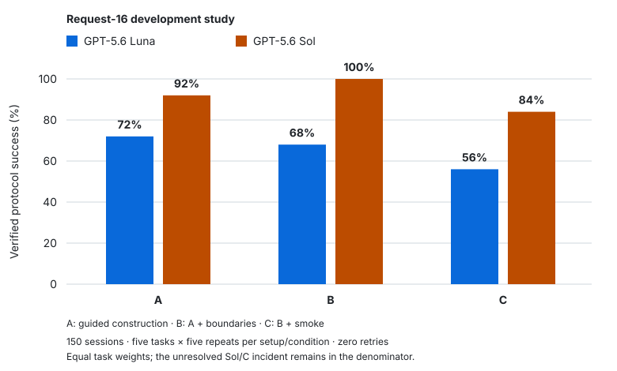

# Experimental results

## Study 1 — Request-16 development study

**Status: complete.** Does scientific assistance help an agent construct an OpenMC
model that meets its public engineering specification?

The study contains **150 terminal assignments, zero retries**: two frozen agent
setups × three conditions × five reused tasks × five repeats. These are development
tasks, not an untouched holdout. Each setup/condition has 25 assignments, with
equal task weights. Verified protocol success means all implemented required
checks passed within declared coverage, with coherent execution evidence.

- **A — guided construction:** generic coding/OpenMC tools, required working
  export, and bounded error repair. A is not tool-free.
- **B — A + guided boundary observations.**
- **C — B + guided short native OpenMC smoke feedback.**

### Primary and secondary results

| Agent setup | A | B | C | Primary C−A | Secondary B−A | Secondary C−B |
|---|---:|---:|---:|---:|---:|---:|
| GPT-5.6 Luna | 72% | 68% | 56% | −16 pp | −4 pp | −12 pp |
| GPT-5.6 Sol | 92% | 100% | 84% | −8 pp | +8 pp | −16 pp |

In this bounded development study, the combined boundary + smoke assistance
package did not improve verified protocol success relative to guided construction.
Observed differences varied by setup and task.

B−A combines access to boundary observations with guidance on their use; it does
not isolate tool access. C−B measures incremental smoke assistance in the presence
of boundary assistance, not smoke alone. These descriptive contrasts do not
establish that inspection or smoke generally helps or harms agents.

The Sol/C incident stays in the success denominator without an imputed scientific
score. Its unresolved success bounds are 84–88%, not a confidence interval.
The [study report](docs/experiments/request16-development-study-v1.md#uncertainty)
retains the existing task-cell Wilson intervals; no pooled IID interval or
significance claim has been added.

### Task-level results

Verified successes out of five assignments per cell:

| Agent setup | Task | A /5 | B /5 | C /5 |
|---|---|---:|---:|---:|
| Luna | axially_zoned_5x5 | 3 | 4 | 4 |
| Luna | reflective_pin_cell | 4 | 4 | 4 |
| Luna | asymmetric_5x5 | 4 | 3 | 4 |
| Luna | reflected_7x7 | 2 | 3 | 1 |
| Luna | two_composition_5x5 | 5 | 3 | 1 |
| Sol | axially_zoned_5x5 | 5 | 5 | 3 |
| Sol | reflective_pin_cell | 5 | 5 | 5 |
| Sol | asymmetric_5x5 | 4 | 5 | 4 |
| Sol | reflected_7x7 | 5 | 5 | 4 |
| Sol | two_composition_5x5 | 4 | 5 | 5 |

Luna's lower C rate is concentrated in the reflected and two-composition tasks;
C exceeds A on the axial task. Sol's C rate is lower on the axial and asymmetric
tasks, with an unresolved incident on the reflected task; C exceeds A on
two-composition. A single pooled headline would obscure this variation.

### What the terminal outcomes mean

| Exclusive terminal category | Assignments |
|---|---:|
| Verified protocol success | 118 |
| Demonstrated physical violation | 19 |
| Model hard-gate failure | 12 |
| Provider/stream incident | 1 |

Hard-gate outcomes can also contain observed physical violations. Numerical
agreement, unresolved coverage and incidents remain distinct from strict success.
The **diagnostic score is secondary**: 149/150 scores are available, including
12 justified gate zeros. Incident 067 has no submission or assessment and
`score=null`; Sol/C's full-arm score mean remains null.

The [development-study report](docs/experiments/request16-development-study-v1.md)
contains assessment rules, numerical and effort summaries, the evaluator amendment,
incident handling, uncertainty and provenance.

## Reading these results

The current public source snapshot provides the earlier A/B construction and
boundary workflow. Request-16 used a later research implementation, including the
v7 assessment protocol and C smoke condition. This documentation does not upgrade
the public evaluator or supply the private study executor, references or raw data.

See the [provenance ledger](docs/experiments/request16-development-study-v1.md#provenance)
for frozen report identities and the [README](README.md) for runnable public examples.
