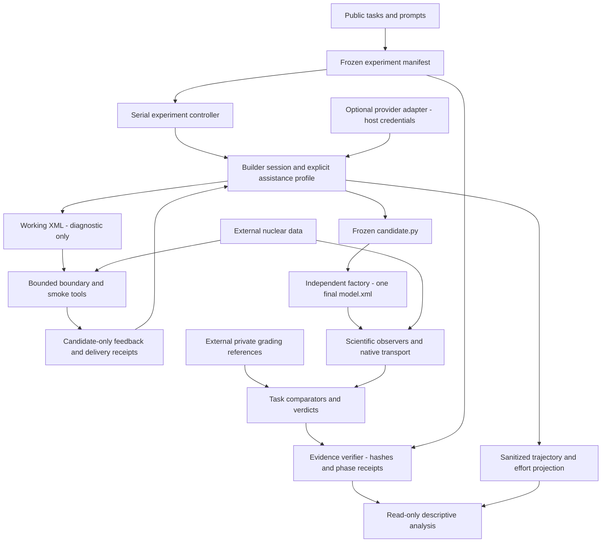

# Public implementation to experimental v7: architectural gap analysis

## 1. Executive summary

This is a source-based capability review and a proposal, not an implementation port or a new qualification of the runtime. The public repository already contains the central scientific architecture: `openmc-model-factory-v1`, an independent single final export, finite all-matching-cell geometry probes, `effective-boundary-observation-v2`, and the study's numerical comparison and score policy. Replacing those components would add risk without closing a demonstrated gap.

The highest-priority correctness gaps are representation-specific source checks and effective-temperature handling. Next come bounded smoke assistance, explicit request/condition profiles, and reusable experiment execution and analysis. The latter require removing historical assumptions rather than copying the archive tree.

**Classification of the 18 required capabilities:** 5 PUBLIC_EQUIVALENT; 7 PUBLIC_PARTIAL; 1 MISSING_SHOULD_PORT; 2 PUBLIC_OBSOLETE; 3 NEEDS_REDESIGN_BEFORE_PORT; 0 EXPERIMENTAL_ONLY_DO_NOT_PORT; 0 UNCLEAR. Each letter receives one overall classification; equivalent subcomponents and excluded historical infrastructure are distinguished below. Zero in the archival category does not authorize porting archival infrastructure.

### Baselines and scope

| Identity | Verified source |
|---|---|
| Public main and merged documentation milestone | `c1853888192fd925cec89c3de2ac0535779cc44a` |
| Annotated milestone tag | `request16-development-study-v1`, tag object `4a97bb97dbd3187ef8c3020a20798a851810220f`, peeled target equals public main |
| Original v7 execution | `8dae2e5a9ab835af2746a77adcaa10d4faf267c7` |
| Final pending-only continuation | `1c2e805edf1303c0ebf0cfb84b2e226bf1917976` |
| Operational reconciliation implementation | `7e6eeb281d87bc8bf53e83efa32f7fbdb3edc2d9` |
| Study closeout | `59f370f54c5edb3f6499af37259e3ae09d3e9ca7` |
| Later mechanistic analysis | `19aa097455e8270ae1e5cfaa58f1a6f33e4b111e` |
| Experimental scientific/authoring identities | `factory-assessment-boundaries-v7`; `authoring-requests-16-v1` |
| Implemented public scientific route | `factory-assessment-boundaries-v4` |

The three documentation commits `2722d31906f388ecea87a790c9434d7f7f06b0dc`, `b22180ed82beb7a6897894de7e606f29242ae636`, and `c515cfdb33a99db568fb31fb9bb65844beedec23` are reachable from main. The old documentation branch was already absent locally and remotely. The existing local/remote annotated tag already had the requested message and target; it was verified, not recreated. No release is part of this task.

Archive source under `builder/`, `evaluator/`, `evaluation/scientific/`, `evaluation/candidates/`, `evaluation/benchmark_suite/`, and `experiments/` is unchanged between the final continuation and archive HEAD. Later mechanistic tooling is reviewed separately as post-study analysis. The companion [source and capability inventory](public-v7-gap-analysis.json) binds the actual reviewed file bytes to these commits. It contains paths and hashes, not study evidence.

In this report, **P** means a path in this public repository; **X** means a source-relative path in the read-only experimental archive at the bound commit. X paths are deliberately plain code references, not broken public links. PUBLIC_EQUIVALENT means parity for the stated capability and its limitations, not proof of exhaustive scientific validity or a newly qualified installation. The completed results and mechanisms remain in the [published study](../experiments/request16-development-study-v1.md) and [mechanistic analysis](../experiments/request16-mechanistic-analysis-v1.md); this report does not recompute them.

## 2. Current public architecture

The critical path is already direct and understandable:

1. [prompts/prepare.py](../../prompts/prepare.py) prepares public task requirements.
2. [builder/route.py](../../builder/route.py) selects the declared assistance and prompt. [builder/run.py](../../builder/run.py) runs the isolated authoring session; [builder/submission.py](../../builder/submission.py) freezes its submitted Python.
3. [evaluation/candidates/run.py](../../evaluation/candidates/run.py), `evaluate`, performs independent evaluation. [evaluator/factory.py](../../evaluator/factory.py) invokes the factory in isolation and exports the returned model.
4. Fresh scientific inspectors examine that admitted XML; [evaluator/transport.py](../../evaluator/transport.py) transports the same admitted final model.
5. [evaluation/candidates/assessment.py](../../evaluation/candidates/assessment.py) maps observations onto checks, while [evaluation/candidates/verify.py](../../evaluation/candidates/verify.py), `review_assessment`, reconstructs evidence before accepting a reported result.
6. [experiments/run.py](../../experiments/run.py) provides a bounded prepare/execute/assess pilot, not the completed 150-assignment study framework.

Public implementation includes guided construction and boundary assistance, an eight-request default, compact boundary feedback, and trajectory projection. It does not implement C smoke assistance or the explicit Request-16 profile. README accurately distinguishes its implemented v4 route from the later study.

There is already provider-specific code: [builder/relay.py](../../builder/relay.py) and host authentication loading in `builder/run.py`. The relay is byte-identical to the reviewed archive relay. Thus the repository is not provider-neutral end to end. Preserve the scientific separation and keep this an optional adapter boundary; do not grow provider internals into evaluation or analysis.

## 3. Final experimental v7 architecture

The final study uses the same factory/export/inspection/transport separation. Its scientifically meaningful extensions are supported spatial/angular source comparisons, effective singleton temperatures, more precise failed-boundary-call evidence, and separately bounded smoke feedback.

X `builder/route.py` maps A to `guided_construction`, B to `guided_boundaries`, and C to `guided_boundaries_smoke` through X `experiments/abc_plan.py`. A includes generic coding and guided working export; it is not a tool-free baseline. B adds boundary assistance; C also adds smoke and associated workflow instructions. Any future comparison must freeze both tool availability and prompt policy.

X `experiments/abc_plan.py` freezes assignments, prepared prompts, client setups, code, references, data identity, budgets, task order and analysis policy. X `experiments/abc_execute.py` serializes execution, consumes a slot before dispatch, verifies retained results, and pauses on new incidents. X `experiments/abc_reconcile.py` records explicit operational permission to continue only with unstarted slots.

The final scientific interpretation uses separate v7 assessments for the inherited 38 slots while preserving their original authoring and v6 results. The later continuation acknowledges incident 067 without retrying or scoring it. These historical bindings explain the archive's complexity; a new public experiment should start from one clean prospective manifest, not replay those amendments.

X `experiments/abc_analysis.py` verifies retained evidence before descriptive analysis. X `analysis_tools/request16_mechanistic/` is later exploratory, study-specific reconstruction. Neither layer supplies proof of model understanding, causal tool benefit, or universal physical validity.

## 4. Capability matrix

| ID | Capability | Overall classification | Decision |
|---|---|---|---|
| A | Candidate contract | PUBLIC_EQUIVALENT | Retain |
| B | Single authoritative final export | PUBLIC_EQUIVALENT | Retain |
| C | Independent final assessment | PUBLIC_PARTIAL | Complete H/I semantic parity and version honestly |
| D | Geometry checks | PUBLIC_EQUIVALENT | Retain finite coverage |
| E | Boundary observer | PUBLIC_EQUIVALENT | Retain bounded observer |
| F | Builder boundary assistance | PUBLIC_PARTIAL | Retain tool; qualify failed-call receipts |
| G | Smoke assistance | MISSING_SHOULD_PORT | Port bounded diagnostic capability |
| H | Source semantics | PUBLIC_OBSOLETE | Replace representation checks within qualified scope |
| I | Effective temperature | PUBLIC_OBSOLETE | Correct singleton semantics and unresolved propagation |
| J | Settings checks | PUBLIC_PARTIAL | Retain existing checks; integrate H/I |
| K | k-effective comparison | PUBLIC_EQUIVALENT | Retain equation and limitations |
| L | Evidence/provenance | PUBLIC_PARTIAL | Retain verifier; add minimal new receipts |
| M | Trajectories | PUBLIC_PARTIAL | Extend reusable delivery/effort projection only |
| N | Budgets/profiles | PUBLIC_PARTIAL | Add explicit Request-16 profile |
| O | Conditions | PUBLIC_PARTIAL | Add controlled C route, avoid historical arm special cases |
| P | Manifest/preregistration | NEEDS_REDESIGN_BEFORE_PORT | Small prospective manifest |
| Q | Runner/reconciliation | NEEDS_REDESIGN_BEFORE_PORT | Preserve invariants, remove historical coupling |
| R | Analysis | NEEDS_REDESIGN_BEFORE_PORT | Reuse descriptive rules, remove fixed-study assumptions |

### A. Candidate contract

**P:** `evaluator/contracts.py`, `evaluator/factory.py`, `builder/submission.py`. **X:** same paths. The sole admitted contract is `openmc-model-factory-v1`: a frozen `candidate.py`, callable `build_model()`, and an `openmc.Model` return. The independent evaluator imports and calls candidate code inside its isolated interpreter. There is no alternate global-model lookup, script fallback, or silent repair. This already prevents substituting an arbitrary builder XML export for the submitted source contract.

**Dependencies/recommendation:** retain factory and container admission unchanged; no port. **Security:** the host must never import the candidate. Capturing the unbound pinned exporter before candidate import and auditing filesystem/export observations are practical controls, not a proof of purity against hostile Python in the same interpreter.

### B. Single authoritative final export

**P/X:** `evaluation/candidates/run.py`, `evaluator/factory.py`, `evaluator/transport.py`, `evaluation/candidates/verify.py`. `evaluate` freezes source/prompt, invokes the independent exporter once, records the accepted final XML hash, then inspects and transports that admitted XML. The pinned `Model.export_to_model_xml` is invoked on the returned model. No active public final-grading path was found that treats a working builder XML file as authoritative or repeats final factory export to select a preferred result.

**Dependencies/recommendation:** retain source/export receipts and XML admission. X adds a separate smoke transport wrapper, not a replacement final export. **Security:** preserve the working-artifact/final-artifact distinction and private evaluator data mounts; matching hashes alone do not establish physics.

### C. Independent final assessment

**P/X:** `evaluator/profiles.py`, `evaluation/candidates/run.py`, `evaluation/candidates/assessment.py`, `evaluation/scientific/inspection.py`, `evaluation/scientific/records.py`; B/D/E/J/K/L supply the other phases. Public orchestration and retained-assessment verification already cover independent factory/export, material/geometry/settings/boundary inspection, native transport, hard gates, cleanup and unknown/null outcomes. The orchestrator and final verifier are byte-identical; the semantic functions they call differ.

**Difference/relevance:** v4 lacks H/I; merely changing the protocol string would misrepresent scientific parity. **Dependencies/recommendation:** integrate the qualified semantic changes and their receipt versions, then qualify a versioned route; do not rewrite the pipeline. **Security:** no private references enter authoring; absent references or unresolved infrastructure do not become scientific passes.

### D. Geometry checks

**P/X:** `evaluation/benchmark_suite/suite_cases.py` (`probes`, `expected`), `evaluation/scientific/worker.py`, `evaluation/candidates/assessment.py`. Task definitions and probe generation are identical. Interior/exterior domain samples, outer faces, active samples, axial extent/material maps and interfaces feed an all-matching-cell traversal. Overlap, gap, missing/lost coverage and unexpected outside observations are distinct from the expected material role. Demonstrated invalid geometry blocks transport; temperature changes in the same worker are separately covered by I.

**Dependencies/recommendation:** preserve deterministic probes, task expectations and model-caused gate attribution. **Limits/security:** finite probes cannot prove global non-overlap, complete coverage or universal CSG correctness. Candidate geometry is inspected in isolation; private expected role maps remain evaluator-side. No new geometric assumptions or adaptive probe tuning are proposed.

### E. Boundary observer

**P/X:** `evaluation/scientific/boundary_worker_v2.py`, `boundary_scope.py`, `boundaries.py`, and `evaluation/candidates/boundary_assessment.py`. The observer, scope and comparator core already match `effective-boundary-observation-v2`. Containment-aware bounds pruning, Boolean simplification and bounded axis-plane arrangements identify a supported open root box and conservative possible face contributors. Loaded boundary type and effective albedo are checked on participating faces, not simply counted in the surface inventory.

The worker caps states at 65,536, work at 4,000,000 and residual atoms at 16 after pruning. Uniform face behavior is required. Mixed patches, conflicting coincident declarations, curved exteriors, filled face hierarchies, periodic coupling, edges and corners remain unresolved/unsupported. Possible contributors are not proof that every contributor touches a face.

**Dependencies/recommendation:** retain observer and private task comparator; do not extend scope. F's receipt change does not alter boundary physics. **Security:** expose observations and limits to the builder, never private boundary verdicts or scores.

### F. Builder-facing boundary assistance

**P/X:** `builder/boundary_tool.py`, `boundary_feedback.py`, `boundary_client.py`, `boundary_bridge.py`, `inspection_receipts.py`; X/P `evaluation/scientific/boundaries.py`. The first four files are identical. Candidate-only compact JSON is bounded to 16,000 bytes; full reports are content-addressed and retained separately. Feedback completeness flags disclose omissions. Presentation completeness is distinct from scientific coverage. The bridge admits bounded XML bytes rather than arbitrary host paths; the caller cannot supply private task verdicts.

**Gap:** X separates completed/cleaned worker execution from a valid observation. It narrowly reconstructs an undefined cell-material reference from the admitted XML and matching worker KeyError. P lacks this qualified failed-call receipt path. This is not permission to convert arbitrary inspector exceptions into candidate defects or scientific zeros.

**Dependencies/recommendation:** small receipt qualification plus tests; retain compact feedback and actual subsequent-request delivery verification in `builder/trajectory.py`. **Security:** retain path confinement, byte/call limits and candidate-only projection; failed execution must not manufacture scientific observations.

### G. Smoke tool

**P:** no smoke assistance module; nearest components are `evaluator/transport.py` and `builder/route.py`. **X:** `evaluator/smoke.py`, `builder/smoke_tool.py`, `smoke_feedback.py`, `guided_smoke.md`, `evaluator/transport.py`. `candidate-smoke-v1` runs a diagnostic copy of working XML: 1,000 particles, 8 batches, 2 inactive, one generation per batch, seed 1, one native thread, 60 seconds native budget, at most two admitted smoke calls, and 180 seconds remaining-session admission reserve. XML is bounded to 500,000 bytes. Public diagnostic log excerpts retain at most 80,000 bytes of head/tail content per stream plus an omission marker; hashes, original lengths and truncation flags describe the retained full streams.

Overrides record original/diagnostic identities and sampling/statepoint/sourcepoint settings, and bind the operator-selected data index. They do not repair geometry, materials, temperature or source physics. Feedback reports candidate runtime diagnostics with truncation/completeness and full-report references; it contains no private reference score or task correctness verdict. A completed smoke run is not final conformity.

**Dependencies/recommendation:** reuse existing isolated transport with a distinct smoke provenance/receipt route, then add the bounded adapter and C wiring. Do not redesign sampling here. **Security/limits:** nuclear data stay in the trusted worker; control XML/log size and data paths. Sixty seconds is a native-process bound, not an end-to-end guarantee; setup, hashing, retrieval and cleanup have additional costs. Tool refusals and delivery must be recorded, not retried for free.

### H. Source semantics

**P:** `evaluation/benchmark_suite/suite_checks.py`, `evaluation/candidates/assessment.py`. **X:** same integration plus `evaluation/scientific/source_space.py` and `source_angle.py`. P recognizes spatial XML types box/fission and an isotropic angular class/default. That can reject supported equivalent representations.

X `uniform-box-source-comparison-v1` recognizes a finite ordered box or independent Cartesian Uniform marginals with the required axis bounds. Fissionable constraint/rejection semantics remain separate checks. X `isotropic-source-comparison-v1` recognizes default/explicit isotropy and qualified independent uniform mu in [-1,1] with uniform phi spanning one full 2π interval and a qualified reference frame. Demonstrated directional/atomic or incorrect bounded support fails; malformed, unsupported, duplicate or unqualified distribution descriptions remain unresolved. Multi-turn angular support is not silently generalized.

**Dependencies/recommendation:** port bounded observation/comparison helpers, field mapping and tri-state propagation together; preserve existing energy and source-constraint checks. **Security:** parse admitted XML as data, never import candidate distribution code. Comparators use evaluator task requirements; feedback must not reveal reference answers. These are supported semantic equivalences, not a general probability-distribution equivalence engine.

### I. Effective temperature semantics

**P/X:** `evaluation/scientific/worker.py`, `inspection.py`, `records.py`, `evaluation/benchmark_suite/suite_checks.py`, `evaluation/candidates/assessment.py`. Public scalar-only extraction can reject an OpenMC-loaded singleton such as `[293.6]` and stop inspection. X `scalar_temperature` accepts finite real scalars or one-element list/tuple representations. It preserves the existing cell → material → default precedence. It rejects booleans, strings, nested/unsupported values, non-finite values and empty/multiple entries without selecting an instance, even if multiple entries are equal.

**Scientific rule:** a qualified finite 293.6 value passes that requirement; a wrong finite value fails; unknown temperatures remain unresolved. A demonstrated wrong value remains false even alongside an unknown elsewhere. The temperature port must carry limitation records and aggregation, not merely unwrap a list. X also advances the scientific inspection receipt from v2 to v3.

**Dependencies/recommendation:** a bounded first slice using the existing inspector/assessment path; no study runner dependency. **Security:** no data/credential access or candidate execution outside current isolation; never broaden to arbitrary array coercion or repair a value.

### J. Settings checks

**P/X:** `evaluation/benchmark_suite/suite_checks.py` (`settings_checks`), `evaluation/candidates/assessment.py` (`fidelity_checks`). Both already check eigenvalue/continuous-energy settings, nearest temperature method, tolerance 1, disabled multipole, particles/batches/inactive/generations per batch/seed, source multiplicity/type/particle/fissionability/rejection/Watt energy, entropy mesh type/dimensions/extent, and final-statepoint inclusion. Missing generations per batch defaults to 1 and missing tolerance to 10 before comparison with task requirements; omission is not automatically conformity.

**Difference/relevance:** H adds semantic source handling and explicit unknown propagation; I concerns effective material temperature, distinct from the settings method/tolerance checks. The study's settings-related failures do not establish a missing public settings evaluator. Allowed XML output/options are not an exhaustive physics/behavior audit: the implemented output requirement is final-statepoint inclusion. Unsupported settings remain visible.

**Dependencies/recommendation:** retain existing requirements; integrate H/I without relaxing defaults or adding an assistance checklist in this parity task. **Security:** evaluator-side settings checks must not be exposed as private scoring feedback; smoke overrides never replace final settings inspection.

### K. k-effective comparison

**P/X:** `evaluation/benchmark_suite/numerics.py`, `scoring.py`, `scoring.json` are identical. For candidate c and reference r:

```text
delta_pcm = 1e5 * (c.mean - r.mean)
sigma_delta_pcm = 1e5 * sqrt(c.std_dev**2 + r.std_dev**2)
agreement = abs(delta_pcm) + 1.96 * sigma_delta_pcm <= 150
resolved_discrepancy = abs(delta_pcm) - 1.96 * sigma_delta_pcm > 150
otherwise: inconclusive
```

Inputs must be finite and the combined standard deviation positive. Numerical inconclusiveness is not a provider incident or proof of a physical defect; it does not demonstrate required agreement. **±150 pcm is an uncalibrated internal development criterion, not a nuclear-safety acceptance criterion.** Combined Monte Carlo uncertainty does not account for common modeling or nuclear-data bias.

**Dependencies/recommendation:** retain frozen references, sampling and comparison exactly; no port. **Security:** private reference means/packages remain evaluator-side and external to builder feedback and publication.

### L. Evidence/provenance model

**P/X:** `evaluation/candidates/receipts.py`, `phase_evidence.py`, `verify.py`, `builder/inspection_receipts.py`, `builder/context.py`; X additionally `experiments/study_evidence.py`. Final receipts and verifier are identical. `review_assessment` reconstructs observations/checks/score: coherent means supported by the retained evidence, contradictory means inconsistent, insufficient means missing or unqualified. Operational/evaluator unknowns remain unscored; a model-caused hard-gate failure can score zero. Neither hashes nor a saved positive summary suffice.

**Minimum useful layer:** task/prompt and submitted-source identity; contract/protocol/profile and code/runtime/data/reference identity; one accepted XML hash; phase exit/cleanup and artifact receipts; attributed gates and checks; null-preserving score; verification status. Add call/delivery identities only for assistance/effort claims, and a small assignment/start/terminal record for experiments. Preserve retained raw artifacts securely enough to verify these records; a sanitized public projection does not replace the private originals.

**Dependencies/recommendation:** retain core, extend only for I/F/G and effective request-setup checks. **Security:** publish allowlisted metadata and bounded synthetic examples; never substitute huge seals, raw provider bodies, credentials or host paths for a clear public evidence contract.

### M. Trajectory reconstruction

**P/X:** `builder/trajectory.py`, `experiments/run.py`; X also `experiments/study_evidence.py`, `analysis_tools/request16_mechanistic/analyze.py`, `interpret.py`, `METHOD.md`. P already joins tool calls/outputs and later requests, records observed working exports, boundary feedback delivery, effort and unknowns. X adds smoke call projection and distinguishes completion from exact feedback delivery; it does not infer interpretation from a call.

Useful reusable elements are call/turn ordering, artifact identities, bounded effort, delivery status and declared coverage. Later forensic tooling reads fixed study locations, switches inherited evidence by order, reconstructs literal patches and contains explicit per-trial interpretations/assertions. It is not a generic trajectory library.

**Dependencies/recommendation:** extend the current projector for smoke and define a small sanitized event view; do not port one-off reconstruction or handwritten mechanism labels. **Security:** current projection consumes private request/response material; keep parser inputs private and publish only an allowlisted summary. Subsequent edits show sequence, not causal learning or understanding.

### N. Request budgets and authoring profiles

**P/X:** `builder/route.py`, `builder/run.py`, `experiments/run.py`, `builder/boundary_tool.py`; X smoke limits in `evaluator/smoke.py`. P has an eight-request experiment default, 600-second authoring wall budget, two boundary calls, 120-second observation budget, a 180-second remaining-time admission check and zero automatic retries. X adds explicit `authoring-requests-16-v1` through `request_limit` and `budgets`; the 600-second authoring budget stays fixed. Boundary/smoke attempts and refusals remain separately recorded. The adapter bounds even over-cap requests; an over-cap diagnostic response is not another admitted scientific tool execution.

**Dependencies/recommendation:** add the explicit validated profile and consistent prompt/manifest/dispatcher/submission accounting, preserving the old default for old runs. Add G's two-call/60-second limits only where smoke is available. No free retry or silent timeout extension. **Security:** profile selection changes no credentials; store effective client/tool setup identity so a name alone cannot conceal a different route. Request limit is not a token budget.

### O. Experimental conditions

**P/X:** `builder/route.py`, `experiments/run.py`; X `experiments/abc_plan.py` maps study letters. Public guided construction and guided boundaries cover the A/B capabilities; C is absent. The archive adds a named smoke condition and alters guidance consistently with its availability. Its A/B/C mapping belongs in study configuration, not private grading logic.

**Dependencies/recommendation:** retain the small named-condition approach; add an explicit smoke condition after G, and freeze its prompt/tool/budget identities. Use manifest-defined arm labels later rather than checks such as “this study's arm C.” **Security/science:** tools receive only candidate observations. Generic coding tools must remain matched and recorded within each setup; an empty top-level tool list does not prove a tool-free baseline. Changes to prompts/tool configuration define a new prospective intervention.

### P. Study manifest/preregistration

**P:** `experiments/run.py` prepares pilot plans. **X:** `experiments/abc_plan.py`, `ABC_STUDY.md`, `abc_temperature_amendment.py`. X freezes two named setups, five tasks, three arms, five repetitions, deterministic shuffled/rotated ordering, all budgets, code/prompt/tool/reference/data identities and analysis policy. Verification detects mismatches and requires committed preparation before dispatch.

**Gap/recommendation:** extract those invariants into a small prospective manifest plus explicit ordered assignment list. Do not copy the fixed 150-cell schedule, local source-closure path, minimum-disk constant, inherited prefix or old authorization strings as universal defaults. Freeze analysis and exclusions before observing new outcomes. **Dependencies:** N/O, stable evaluator identities and resource preflight. **Security:** serialize data/reference identifiers, not machine-specific paths; operator locations stay in local configuration. No credentials or raw provider content belong in a manifest.

### Q. Serial runner and explicit reconciliation

**P:** `experiments/run.py` prevents simple re-execution and records summaries, but has no equivalent study-wide selector/reconciliation state machine. **X:** `experiments/abc_execute.py` (`execute_trial`, `pending_assignments`, `run`), `abc_reconcile.py` (`identity`, `validate`, `create`), `abc_plan.py`. X exclusively creates and fsyncs a start receipt before dispatch, records terminal outcomes atomically, reconstructs finished evidence on resume, selects only pending assignments in order, and pauses on any new unreconciled incident. A started slot without a terminal record is consumed and blocks automatic continuation.

A reconciliation binds study/manifest/launch/result/artifact hashes, review commit, operator decision and timestamp. It never rewrites the incident or its scientific score. The current implementation is deliberately narrow: unscored provider/stream incidents without submission/assessment, fixed cause-not-established, a specific operational source allowlist and the historical schedule/amendment. Those constraints are not a general public incident schema.

**Dependencies/recommendation:** build a small manifest-driven serial runner retaining permanent consumption, exclusive locking, explicit permission and no automatic retries. Separate operational implementation identity from frozen scientific dependencies prospectively; do not import a historical code-delta exception. **Security:** permission is scoped and evidence-bound, never inferred from an error event. Keep provider payloads and forensic narratives external. Atomic files/fsync are useful crash controls, not a demonstrated guarantee against every filesystem/power-loss failure.

### R. Analysis layer

**P:** `experiments/run.py` (`assessment_summary`) and `builder/trajectory.py` provide outcome/check/effort projections, not balanced study analysis. **X:** `experiments/abc_analysis.py`, `study_evidence.py`, later `analysis_tools/request16_mechanistic/analyze.py` and `interpret.py`. X verifies sealed retained evidence, uses all started assignments in verified-success denominators, excludes null scores from available-score means, computes per-cell Wilson intervals, and supplies unresolved identification bounds. Equal task weights and balanced contrasts appear only after the full planned inventory is terminal. C−A is the primary study contrast, B−A/C−B secondary, separately by setup. Effort records actual feedback delivery and missing/token completeness.

Per-trial family/check and numerical outcomes are projected by the frozen analyzer; the later mechanistic scripts add study-specific family counts and explanations. They are not interchangeable layers. Families can overlap; numerical non-success, physical violations, delivery failures and incidents remain distinct. Bounds are not confidence intervals; Wilson intervals are descriptive, not an IID causal interval for a cross-task contrast.

**Dependencies/recommendation:** reuse pure statistical/denominator rules over verified records; declare contrasts in P instead of hard-coding two model names, arm letters or retrospective illustrations. Preserve the predeclared first verified success/non-success rule when requested, including absent examples. **Security:** analyze minimal verified rows and evidence references; do not distribute raw transcripts, private reference packages or mechanistic per-trial overrides.

## 5. Obsolete public components

“Obsolete” here means a superseded behavior to replace prospectively, not permission to relabel retained results.

- H: spatial type/parameter and angular class-only checks in `suite_checks.settings_checks`.
- I: scalar-only effective-temperature extraction, associated v2 inspection receipt and aggregation unable to preserve qualified singleton/unknown semantics.
- N: fixed eight-request experiment assumptions when implementing a declared Request-16 run. Eight remains a valid explicit legacy profile; it is not a hidden sixteen-request profile.
- C: the v4 protocol identity correctly describes current behavior but cannot label a parity-complete future route.
- `boundary_scope.task_matrix` contains descriptive text naming v3 for the cylinder refusal in both repositories. It is stale explanatory text, not evidence that the active v4/v7 route secretly executes v3.

**Not found as active gaps:** repeat final export selection, builder XML used as final grading evidence, an earlier boundary observer, or a different score rubric. Legacy reference-criterion migration checks mentioning repeat export are not repeated candidate evaluation. Do not remove them solely on a text match.

## 6. Missing capabilities worth porting

These are proposed bounded ports/extractions, not authorization to implement them. Test IDs refer to section 10; security IDs to section 11. Complexity/risk are engineering estimates based on coupling, not measured effort.

| Port | Value and scope | Complexity / principal risk | Dependencies | Public API effect | Required tests |
|---|---|---|---|---|---|
| P1: effective temperature | Correct false unsupported outcomes; carry singleton/unknown semantics through receipts and checks | Small–medium / false conformity if unknowns collapse | Existing inspector, rubric, versioned receipts | New receipt/protocol identity; no factory signature change | T1 |
| P2: source semantics | Supported spatial/angular equivalence instead of XML class identity | Medium / over-broad distribution equivalence | Bounded XML admission, settings field mapping, tri-state checks | Additional semantic observations and versioned route | T2 |
| P3: failed boundary receipts | Distinguish clean worker failure from absent/untrusted execution | Small / over-attributing arbitrary exceptions | Existing boundary observer, compact feedback and receipt verifier | Add qualified failure receipt; feedback contract preserved | T3 |
| P4: bounded smoke | Candidate runtime feedback without final-grading leakage | Medium / confusing diagnostic success with final correctness | Isolated transport, data binding, bounded adapter, P3 receipt discipline | New tool and explicit condition; separate receipt kind | T4 |
| P5: request/condition profiles | Freeze matched interventions and explicit sixteen-request accounting | Small–medium / mismatch between prompt, plan and dispatched tools | Existing route/run/submission; P4 for C | Optional explicit profile/condition; keep old defaults | T5 |
| P6: trajectory projection | Actual delivery and effort with honest missingness | Medium / false delivery or inferred interpretation | Existing projector, P4/P5 call and request receipts | Versioned sanitized event/summary fields | T6 |
| P7: prospective manifest | Reproducible assignments, budgets, identities and analysis definitions | Medium / accidental historical defaults | P1/P2-qualified route, P5 and public task definitions | New prepare/verify manifest interface | T7 |
| P8: serial runner | Permanent slot consumption and reviewed pending-only continuation | Medium–high / duplicate dispatch or unreviewed continuation | P7, evidence verifier, explicit preflight | New start/status/dry-run/resume/reconcile interface | T8 |
| P9: descriptive analysis | Task weights, uncertainty/bounds, family and effort denominators | Medium / invalid pooling or null-to-zero conversion | P7/P8 retained verified rows, P6 | New read-only analysis outputs/CLI | T9 |

P1/P2 complete the main scientific gaps; P3 is receipt integrity, not new boundary physics. P7–P9 should be small direct functions over explicit data, not a generic experiment plugin framework. Preserve the existing folder organization unless a concrete dependency requires a change.

## 7. DO_NOT_PORT

| Category inspected | Source example (X unless P noted) | Disposition and reason |
|---|---|---|
| Raw provider request/Responses streams and encrypted content | `builder/run.py` retention, `builder/relay.py`; both also P | Keep runtime evidence access-controlled; never copy payloads into public fixtures/docs. Metadata or synthetic streams suffice for public tests. |
| Subscription relay expansion and host credential state | `builder/relay.py`, `builder/run.py` | Relay code already exists publicly. Do not import further private/provider internals or auth files. Keep credentials host-side and adapter-specific; no evaluator dependency. |
| Private grading references | `evaluation/benchmark_suite/references.py` and its frozen-package interface | Preserve external evaluator-only provision and hashes; do not vendor answer packages. A hash is not a redistribution license or authenticity proof. |
| Nuclear-data locations and machine configuration | `experiments/abc_plan.py` data-index binding; evaluator data mounts | Public identity/configuration contract only. No personal paths or local data contents. Review data rights/sensitivity separately before any release. |
| Statepoint/HDF5 archive and complete raw evidence trees | transport receipt/artifact consumers | Keep external storage/integrity policy; no bulk repository import. Public summaries do not pretend to contain all evidence needed for replay. |
| Huge forensic seals and historical source inventories | `abc_analysis.load`, mechanistic seal verification | Retain archive bindings there; new experiments use a minimal verifiable inventory, not copied thousands-file historical seals. |
| Local Docker acquisition state and host-specific runtime identities | `evaluator/profiles.py`, runtime Dockerfiles; also P | Preserve isolation and reproducible build descriptions. Do not treat old local image IDs, daemon state or private mounts as clean-machine qualification; requalify future supported environments. |
| Incident-specific diagnostics and reconciliations | `abc_reconcile.py`, historical incident records | Port only evidence-bound operator permission/no-retry invariants. No incident 067 files, provider diagnosis, special trial ID or causal label in a generic runner. |
| Retrospective source reconstruction and manual mechanism labels | `analysis_tools/request16_mechanistic/analyze.py`, `interpret.py` | Fixed paths/order splits and per-trial annotations are exploratory analysis artifacts, not reusable harness requirements. |
| Historical study/amendment/pilot implementations | `experiments/study.py`, `continuation.py`, `budget_pilot.py`, `abc_temperature_amendment.py` | Preserve archive history. A fresh public manifest must not inherit old consumed prefixes, v6→v7 migrations or study-specific authorization text. |
| Supplied-defect repair experiments | `builder/repair_input.py`, smoke repair helpers | Separate research intervention; unnecessary for from-scratch v7 parity. |

The same exclusions apply even when a historical module contains a useful function: extract and test the final invariant rather than carrying its forensic environment along.

## 8. Proposed clean target architecture

Retain existing names: `builder/` owns authoring and bounded assistance; `evaluator/` owns isolated construction/inspection/transport; `evaluation/scientific/` owns observations; `evaluation/benchmark_suite/` and `evaluation/candidates/` own task comparison, verdicts and verification; `prompts/` and `prompts/cases/` own public requirements; `experiments/` owns prospective manifests, serial execution and read-only analysis.

This is a dependency/responsibility proposal, not a request to rename everything into a new `harness/` tree.



Diagnostic tools receive nuclear data only where smoke requires it; private grading references must never cross that boundary. Authoring has no dependency on private task comparators. Experimental orchestration calls scientific evaluation; scientific evaluation does not import the runner, provider relay or historical study.

## 9. Prioritized porting roadmap

- **Phase 0 — preserve baseline:** this report, bound source inventory and passing public tests. Preserve A/B/D/E/K; no mass code sync, no runtime claims from docs tests.
- **Phase 1 — final evaluation parity:** P1 first, then P2; qualify updated observer receipts, tri-state verdict propagation and honest protocol identity. Reuse the existing factory/export/verifier/rubric. P3 qualifies observation-failure provenance without expanding geometry/boundary scope. Full v7 parity requires all relevant semantic/receipt dependencies and qualification; never obtain it by changing a constant alone.
- **Phase 2 — assistance parity:** P4, P5 and P6. Keep compact boundary feedback unchanged apart from validated receipt handling. Freeze C's guidance and tool limits; separate smoke success from final assessment and actual delivered feedback from merely completed calls.
- **Phase 3 — prospective experimental framework:** P7 → P8 → P9. Remove fixed model/task/arm/150-session assumptions. Require local dry-run tripwires before any live execution and hold balanced comparisons when inventory is incomplete.
- **Phase 4 — future-study features, separate proposals:** final-submitted-source identity intervention (value: reduce working/final divergence; risk: changing the authoring contract); public-settings checklist (value: explicit public obligations; risk: unmatched extra assistance); conditional smoke (value: test targeted use; risk: selection bias); holdout tasks (value: assess transfer; risk: new reference/coverage requirements). These are prospective interventions, not v7 ports. Each requires frozen policy, appropriate routing/coverage tests, security review of new inputs and a new study authorization. None is implemented or implicitly approved here.

## 10. Testing strategy

**Actually run for this documentation task:** `python3 -B -m unittest discover -s tests -p 'test_*.py' -v`: **115 tests passed, 0 failures/errors, 0 skipped**. These are the public local tests using synthetic fixtures and dispatch/container doubles; no live LLM, study-candidate factory execution or native OpenMC transport was launched for this analysis. Archive tests were inspected as test specifications, not executed.

Public controls already include `tests/test_model_factory.py`, `test_evaluator.py`, `test_transport.py`, `test_boundaries.py`, `test_boundary_reduction.py`, `test_boundary_adapter.py`, `test_guided_authoring.py`, `test_isolated_builder.py` and `test_response_reader.py`. Passing them preserves baseline behavior; it does not qualify the proposed ports.

| Test set | Acceptance cases for a future authorized slice |
|---|---|
| T1 | Finite scalar/list/tuple singleton; wrong 600 K retained; missing/non-finite/empty/distributed/nested/bool/string unresolved; equal multi-entry list not collapsed; cell/material/default precedence; wrong+unknown remains false; null survives score/review; mismatched receipt rejected. X `tests/test_effective_temperature.py` and `tests/temperature_controls.py` are bounded starting controls. |
| T2 | Box vs independent Cartesian uniforms; wrong axis bound; missing/duplicate axes; nonuniform marginal; default/explicit isotropy vs qualified mu-phi; wrong mu/phi support; unknown reference frame and multi-turn support; malformed XML; false vs unknown propagation and unchanged energy/constraints. X `tests/test_source_space.py`, `test_source_angle.py`. |
| T3 | Retained XML proves missing material ID and matches clean failed worker receipt; mismatched error/ID/hash, unsupported failure, absent cleanup and tampering do not gain credit; no extra observation/transport. X `tests/test_boundary_load_failure.py`, `test_boundary_v2_evidence.py`. |
| T4 | Exact smoke override projection and before/after hashes; unchanged model physics; seed/thread/time/call/admission caps; refusal accounting; XML confinement; oversized/truncated logs; cleanup and worker failure; distinct smoke/final receipt types; no reference verdict leakage. X `tests/test_smoke.py`; native qualification must be a separately authorized bounded control. |
| T5 | Eight default vs explicit sixteen, reject unknown profile; equal within-setup request configuration; A/B/C prompts/tool inventories and absence of private data; budget enforced at dispatch and submission; zero retry; two-call boundaries/smoke plus over-cap refusals. X `tests/test_abc_plan.py`, `tests/abc_route_control.py`; public guided-authoring tests. |
| T6 | Tool completion without later request is not delivery; exact output/call ID match; delayed write-stdin receipt; duplicate/partial feedback stays unproved; known zero differs from missing; token completeness separate; no interpretation claim. X `tests/test_trajectory_events.py` and smoke controls. |
| T7 | Literal expected assignment ordering/counts; freeze task/model/arm/repetition/configuration/analysis; changed prompt/tool/data/reference/protocol rejects; no model or native dispatch on prepare/verify. New synthetic small manifests, not copies of Request-16 evidence. |
| T8 | Start flush precedes dispatch; crash leaves slot consumed; no historical restart; unreconciled incident blocks; reconciliation tied to exact study/result/review, stale/tampered/uncommitted permission rejects; eligible pending range/order only; a second incident pauses; finished results/null scores unchanged. X `tests/test_abc_execute.py`, `test_abc_reconcile.py` supply invariant examples, not a ready generic fixture set. |
| T9 | Hand-computed small datasets for equal task weights, C−A/B−A/C−B per setup, Wilson intervals and identification bounds; null/available-score denominators; incomplete inventory withholding; overlapping family trial counts; numerical vs physical vs incident buckets; actual effort coverage; predeclared first examples. X `tests/test_abc_analysis.py`; do not derive expected values exclusively from implementation. |

All 123 inventoried source/commit bindings and 14 local documentation links passed verification. The credential/private-path/provider-payload pattern scan found no matches in the two new documents; this is a bounded scan plus source review, not a general security certification. The Mermaid diagram parsed and rendered with zero external requests and was visually inspected. Before/after archive checks matched for 57,267 tracked files (1,216,786,893 bytes), Git status, and metadata for 458 untracked files. Public main and implementation remained unchanged.

Documentation verification checks every linked public path, every inventoried source byte/commit, classification totals, Mermaid syntax, absence of private absolute paths/provider payloads, and a docs-only staged change. Archive preservation compares all tracked file bytes and tracked/untracked Git status plus untracked file metadata before and after. It does not claim a content audit of ignored files or untracked binary HDF5 data.

## 11. Security/publication considerations

For every proposed port below, **C** = credentials, **P** = provider coupling, **L** = private local paths, **R** = private references, **A** = large artifacts, **S** = sensitive-data/release considerations. “None needed” describes the proposed design, not a blanket certification of all dependencies.

| Port | C | P | L | R | A | S |
|---|---|---|---|---|---|---|
| P1 | None needed | None | Keep worker errors bounded/sanitized | Compare evaluator requirements only | Small JSON observations | Synthetic temperature fixtures; no new data release |
| P2 | None needed | None | XML identifiers only | Keep expected requirements evaluator-side | Bound XML/projection | Public semantic fixtures, no reference packages |
| P3 | None needed | None | Sanitize exception/receipt details | No private verdict in feedback | Bounded XML/error receipt | Synthetic undefined-ID controls |
| P4 | Host credentials never mounted | Tool contract independent; adapter separately wired | Operator data location kept local | Nuclear data worker-only; no grade/reference feedback | Bound XML/logs; external HDF5 policy | Reuse approved local data, review any new distributed fixtures/data |
| P5 | No auth in profile/manifest | Record adapter identity/config; do not transplant subscription internals | Avoid environment dumps | Public prompts/tools only | Hash tool inventories instead of copying transcripts | Review prompt/fixture origin before publication |
| P6 | Never publish raw auth/transcripts | Normalize via existing adapter, do not hardwire provider bodies into scientific records | Allowlist evidence references | Exclude private task results from authoring projections | Small event summary; raw originals retained privately | Redact personal/proprietary transcript content; synthetic public tests |
| P7 | No secrets in manifest | Declare adapter/setup identity, not auth state | Separate local resolver from public IDs | Hash/identify external packages | Small inventory, no archive clone | No assumption that hashes authorize sharing data |
| P8 | Dispatch delegates to optional adapter | Generic incident state; provider details external | Relative local evidence IDs; sanitize errors | Preserve evaluator isolation | Bounded operational receipts | Review notes must not embed private/provider payloads |
| P9 | No auth required | Consume verified rows, not provider APIs | Public-safe evidence references | No raw reference means/package import for publication | CSV/JSON summaries, external raw store | Review outputs and task provenance before release |

No export-control determination is made from this architectural review. No identified port requires copying controlled/private nuclear data; any future data or model distribution needs its own rights/sensitivity review. Keep source-based findings distinct from a legal or runtime-security certification.

The public relay/auth handling and local runtime pins are existing coupling, not newly copied material. A later adapter/environment cleanup may be appropriate, but is outside the recommended first slice. Tests and new documentation must never require a personal login or reveal a host nuclear-data path.

## 12. Recommended FIRST implementation slice

**Implement only qualified effective-temperature semantics and its evidence propagation (P1).**

Bounded scope: `evaluation/scientific/worker.py`, `inspection.py`, `records.py`, `evaluation/benchmark_suite/suite_checks.py`, `evaluation/candidates/assessment.py`, focused tests, and the minimum protocol/receipt documentation and identity changes needed to describe the changed behavior honestly. Reuse the existing inspector; do not introduce a generic normalization framework, change task temperatures, broaden supported types, modify scoring weights, add smoke, or import the study runner.

Acceptance: finite scalar and singleton list/tuple temperatures are equivalent within the existing precedence rule; a wrong finite value fails; unsupported/non-finite/distributed values remain unresolved; false evidence is preserved alongside unknowns; reviewed scores respect those distinctions; old evidence is not silently relabeled. Run T1 and the full public local suite. Before declaring OpenMC-loaded end-to-end qualification, use separately authorized bounded pinned-runtime inspection controls; transport is unnecessary for testing this extraction rule.

This is independently useful scientific correction with a small dependency surface. It does not by itself establish complete v7 parity. **No implementation is performed in this analysis task.**
