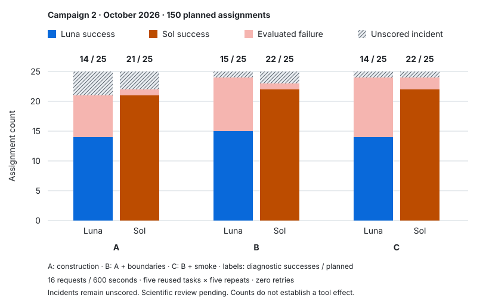

# October Request-16 campaign closeout

**150 terminal assignments: 108 successes, 30 evaluated failures, 12 incidents.**

This is the closeout of `campaign-150-rerun-01`, a prospective development study
completed on 2026-10-03 at 14:59:40 UTC (16:59 Paris). It started on 2026-10-02 at
21:53:05 UTC. Completion means the planned inventory has been consumed; it does
not mean that 150 models were generated or evaluated successfully.

The [public data](campaign-150-rerun-01.json) contain counts for every
model/configuration/task, an incident inventory, and provenance digests. They
contain no candidate code, conversations, private reference answers or nuclear
data. The separate [historical Request-16 study](request16-development-study-v1.md)
retains its original results and v7 protocol.

## Design and interpretation

- Two agent setups: GPT-5.6 Luna (medium reasoning) and GPT-5.6 Sol (low reasoning).
  Their generic tool declarations also differ; this is not an isolated comparison
  of bare model capability.
- A: guided construction with generic coding tools; B: A plus boundary assistance;
  C: B plus bounded native smoke assistance. Access and guidance vary together.
- Five reused tasks, five repetitions per task/model/condition: 25 assignments
  per model/condition. The allowance is 16 requests and 600 authoring seconds.
- No consumed assignment was retried or replaced. The retained builder records
  contain 884 model requests, including the budget-exhausted attempt.
- Final assessment uses `factory-assessment-boundaries-v4-temperature-source-v1`.
  This public implementation is not the historical v7 implementation.
- Reports retain `grading_enabled=false` and `pending_owner_review`. Success
  means passing the implemented diagnostic protocol with coherent retained
  evidence, not scientific qualification or a safety determination.

## Results

This is the primary campaign presented in [RESULTS.md](../../RESULTS.md).

| Setup | Condition | Success | Evaluated failure | Incident | Planned |
|---|---|---:|---:|---:|---:|
| Luna | A | 14 | 7 | 4 | 25 |
| Luna | B | 15 | 9 | 1 | 25 |
| Luna | C | 14 | 10 | 1 | 25 |
| Sol | A | 21 | 1 | 3 | 25 |
| Sol | B | 22 | 1 | 2 | 25 |
| Sol | C | 22 | 2 | 1 | 25 |

Across the campaign, 108/150 assignments (72%) produced verified diagnostic
success. Among the 138 scored assignments, 108/138 (78.3%) succeeded. The latter
denominator excludes incidents and must not be substituted for end-to-end
reliability. Incident placement changes the task mix of the scored subset.

| Task | Success | Evaluated failure | Incident |
|---|---:|---:|---:|
| `reflective_pin_cell` | 24 | 4 | 2 |
| `reflected_7x7` | 24 | 4 | 2 |
| `two_composition_5x5` | 18 | 10 | 2 |
| `axially_zoned_5x5` | 22 | 5 | 3 |
| `asymmetric_5x5` | 20 | 7 | 3 |

Sol has more observed successes in each condition. A benefit of B/C over A is
not established. These counts do not establish that tools caused lower
performance. Missing outcomes are unevenly distributed; five repeated development
tasks do not establish generalization to new tasks. No significance analysis was
performed for this closeout.

## Failure analysis

The 30 evaluated failures have the following primary categories, in precedence
order: invalid geometry at inspection (11), factory export failure (1), remaining
geometry nonconformity (7), and remaining settings nonconformity (11). A run may
also have secondary defects; this partition counts each run once.

The mutable-region alias pattern discussed during the campaign is confirmed in
runs 009, 015, 030, 052, 070, 085, 123 and 136. Assigning a region to a second name
and then applying `&=` to an OpenMC intersection mutates the shared object.
Reusing its complement for outer water can introduce overlaps. These examples
span both setups, all three conditions and two tasks. They motivate a targeted
intervention; no repair experiment was performed in this closeout.

Other defects include wrong fuel placement, water in required void gaps,
temperature lookup settings, and generations per batch. Run 092 contains a final
submission construction error after a successful working export. High partial
scores and completed transport do not establish complete task conformity.

Retained trajectory summaries record 45 sessions using smoke, 49 completed smoke
calls, five incomplete calls and one call not started. Of 43 sessions with at
least one completed smoke, 33 ultimately succeeded and ten failed assessment.
This demonstrates limited diagnostic coverage. It does not demonstrate that
smoke caused the failures or reveal the agent's internal understanding.

## Incidents and continuation policy

| Incident class | Count | Assignment prefixes |
|---|---:|---|
| Builder preflight timeout, zero model requests | 7 | 117, 118, 129, 130, 131, 132, 133 |
| Runtime identity timeout after authoring | 1 | 116 |
| Export preflight failure after authoring | 1 | 119 |
| Unsupported source-point representation in evaluator | 1 | 004 |
| Native exit without recognized model-failure attribution | 1 | 002 |
| Authoring request budget exhausted | 1 | 021 |

Run 002 also has observed boundary defects, but its retained assessment is
unscored. Run 021 is a failure to deliver within the authoring budget, not a
demonstrated infrastructure failure. Preserve both distinctions when analyzing
end-to-end behavior.

The initial launcher paused after an incident. An explicitly authorized
continuation then processed pending slots, retaining all consumed attempts. Its
amendment records the original manifest digest, prior progress and controller
digest. Authoring/scientific sources were checked against the frozen manifest.

The retained [controller](../../experiments/continue_campaign.py) checks locks,
source/plan identities, cleanup and environmental prerequisites. Its important
limitation is that a cleaned-up builder failure becomes a consumed incident and
does not stop subsequent slots, even for repeated initialization timeouts. Seven
slots consequently ended before the first model request. The underlying host
slowdown has not been established. A future repeated-incident stop policy and
any recovery campaign require separately recorded changes; do not replace these
original outcomes with successful retries.

## Dashboard and archival boundary

The dashboard chart retains the existing aggregation rules. Missing observed
identities currently suppress comparison percentages for this campaign. The
chart therefore displays success counts and hatched unresolved counts, alongside
a table containing failures and denominators. It does not manufacture rates
from blocked aggregates. Comparable cohorts can display existing equal-task-weight
rates and unresolved-outcome bounds, which are not confidence intervals.

Raw evidence remains in the private local campaign directory. This PR does not
create or verify an independent backup. Before any local cleanup, preserve that
directory, its source snapshots, continuation receipts and required execution
artifacts in a separate private archive with a file inventory and hashes. A Git
branch alone does not retain ignored `scratch/` files. Do not publish raw traces
or private references as part of that archival operation.

## Provenance and checks performed

The JSON records the source base commit, original manifest and launch digests,
final progress digest, continuation digest, and the as-used controller digest.
All **142 available report/review pairs** have matching canonical report bindings.
The **138 scored rows** agree with their coherent retained reviews and strict
success flags. Aggregate totals were reconstructed from those rows.

These are retained-evidence consistency checks, not fresh native execution,
scientific requalification, or proof against an operator rewriting all records.
No candidate, model call or OpenMC simulation was rerun. Public counts can be
reconstructed by grouping `by_task_and_condition` in the JSON; auditing the
underlying assessments requires the private evidence. The dataset and this
report must remain identified separately from future recovery results.
