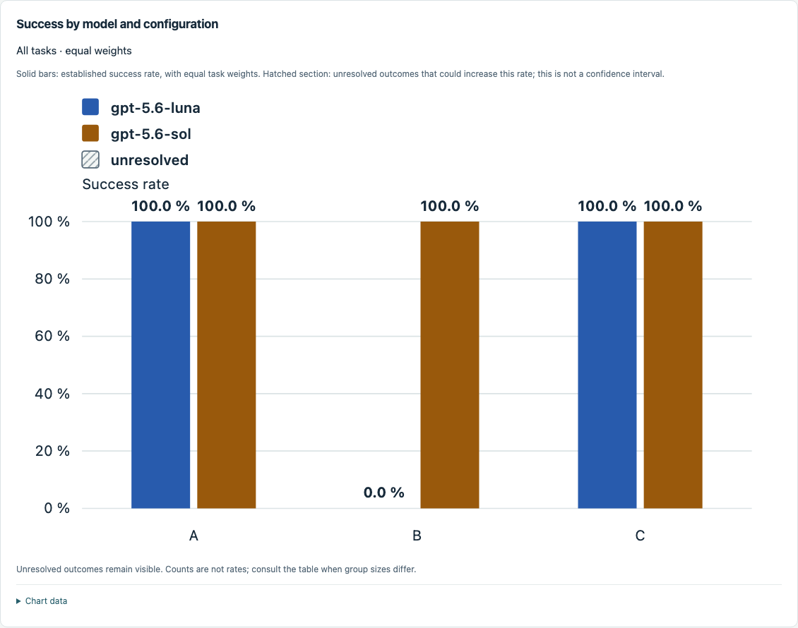
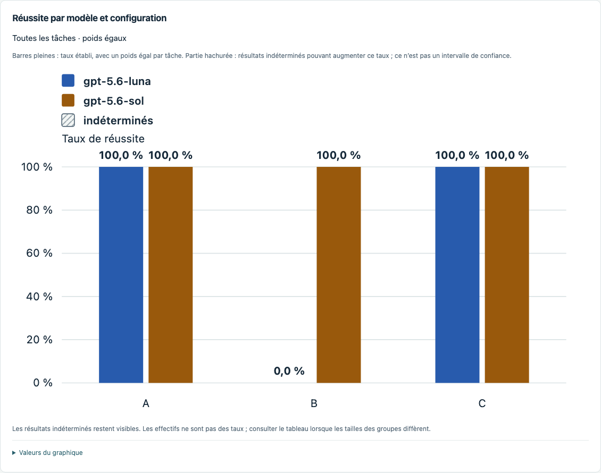
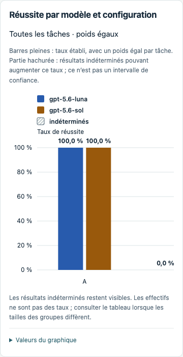

# Dashboard model legend validation — 2026-10-04

The existing HTML legend used inline background styles, which the dashboard's
`style-src self` Content Security Policy blocked. `campaignChart()` now renders
model swatches, labels and the unresolved-outcome key inside the SVG using
presentation attributes. Full-campaign cohort ordering keeps swatch/bar colors
stable across model and task filters. SVG dimensions and stylesheet rules keep
text readable on narrow screens, with horizontal scrolling inside the chart.

## Verification

- `python3 -B -m unittest discover -s tests -p 'test_*.py' -v`: **387 passed**.
- Node run templates, chart controls, campaign templates, evolution templates and
  interrupted-assessment templates: **passed**.
- `node tests/test_dashboard_browser.cjs http://127.0.0.1:8769 scratch/dashboard-legends-results`:
  **passed**, using installed Playwright and Chromium **149.0.7827.55**.
  The server used a fresh selection generated with
  `python3 -B -m tests.dashboard_browser_fixture --output scratch/dashboard-legends-fixture`.
  It was started with `python3 -B -m dashboard.server --campaign scratch/dashboard-legends-fixture/selection.json --port 8769`.
  Set `DASHBOARD_PLAYWRIGHT_MODULE` and `DASHBOARD_BROWSER_EXECUTABLE` to installed
  paths when they are not available by default, as described in the dashboard README.
- `git diff --check` and Node syntax checks: **passed**.

Browser checks cover EN/FR legends, each swatch matching its bars, stable colors
when filtering to Sol, count-mode legends, text size/bounds, a 390 px viewport,
all six views, navigation, stale network state and inert text. No JavaScript page
errors or CSP violations were observed. The desktop and mobile screenshots below
were visually inspected; the mobile plot scrolls horizontally while both model
labels remain readable. See [the browser result](result.json).

The values in these screenshots are deliberately **synthetic test fixtures**,
not measurements of model performance. No private campaign artifacts, model calls
or native solver runs were used. This validates Chromium rendering and portable
behavior; other browser engines and scientific qualification were not tested.

## Screenshots

English desktop:

French desktop:

French mobile (390 px viewport):

